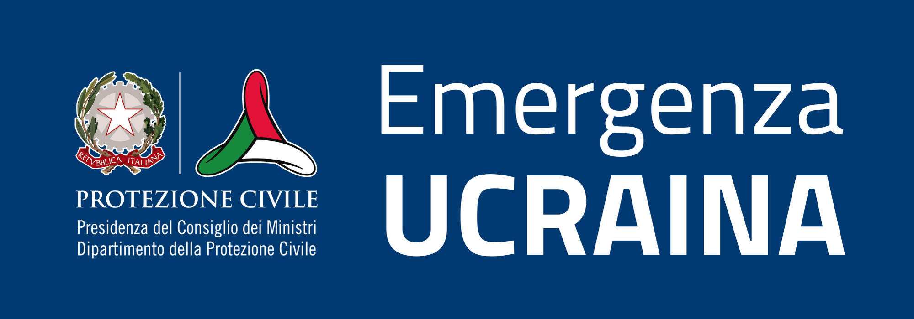

# Ingressi alle frontiere / Border entry

| IT|EN|
|-|-|
|**Fornisce i dati sugli ingressi in Italia su base giornaliera.** In seguito alla guerra scoppiata in Ucraina a partire dal 24 febbraio 2022, la popolazione in fuga dal Paese è stata accolta e assistita in primo luogo dagli Stati confinanti. Contestualmente, anche in Italia sono state avviate le attività necessarie a garantire l’accoglienza delle persone in arrivo nel nostro Paese.|**Data on entries into Italy on a daily basis.** Following the war in Ukraine as of February 24, 2022 the population fleeing the country was primarily received and assisted by neighboring states. Simultaneously, the necessary activities to ensure the reception of people arriving in Italy have started.|

Dati forniti da / Data provided by: **Ministero dell'Interno Direzione centrale dell'Immigrazione e della Polizia delle frontiere** 
Produzione Opendata e dashboard / Opendata production and dashboard: **Dipartimento della Protezione Civile**

## Aggiornamento dei dati / Data update

Giornaliero alle 15:00 / Daily at 03:00pm 
I dati si riferiscono al giorno precedente / The data refer to the previous day

## Processo / Process

| IT|EN|
|-|-|
|Raccolta dei dati da parte della Polizia di frontiera e della Polizia Ferroviaria|Data collection by the Border Police and the Railway Police|
|Ricezione dei dati da parte del Ministero dell'Interno|Receipt of data by the Ministry of the Interior|
|Produzione del dataset open|Opendata dataset production|
|Pubblicazione dashboard|Dashboard publishing|
|Pubblicazione dati|Opendata publishing|

## Dashboard

[https://mappe.protezionecivile.gov.it/it/mappe-e-dashboards-emergenze/mappe-e-dashboards-ucraina/ingressi-alle-frontiere](https://mappe.protezionecivile.gov.it/it/mappe-e-dashboards-emergenze/mappe-e-dashboards-ucraina/ingressi-alle-frontiere)

## Dataset

**Directory:**  [border-entry](../data/border-entry/) 
**Nome file / Filename (csv):** [dpc-ukr-2022--border-entry.csv](../data/border-entry/dpc-ukr-2022--border-entry.csv) 
**Nome file / Filename (json):** [dpc-ukr-2022--border-entry.json](../data/border-entry/dpc-ukr-2022--border-entry.json) 

|Nome campo Field name|Descrizione Description|Formato Format|Esempio Example|
|-|-|-|-|
|**date**|Data e ora di aggiornamento Update datetime|Datetime YYYY-MM-DDTHH:MM:SSZ ISO 8601|2023-04-14T15:00:00Z|
|**border_patrol_women**|Numero di donne (Polizia di frontiera) Number of women (Border Patrol)|Number|0|
|**border_patrol_men**|Numero di uomini (Polizia di frontiera) Number of men (Border Patrol)|Number|0|
|**border_patrol_minors**|Numero di bambini (Polizia di frontiera) Number of children (Border Patrol)|Number|0|
|**railway_police_women**|Numero di donne (Polizia ferroviaria) Number of women (Railway Police)|Number|0|
|**railway_police_men**|Numero di uomini (Polizia ferroviaria) Number of men (Railway Police)|Number|0|
|**railway_police_minors**|Numero di bambini (Polizia ferroviaria) Number of children (Railway Police)|Number|0|

## Licenza / License

 
[CC-BY-4.0](https://creativecommons.org/licenses/by/4.0/deed.it) - [Visualizza licenza](https://github.com/pcm-dpc/UKR-2022/blob/master/LICENSE)